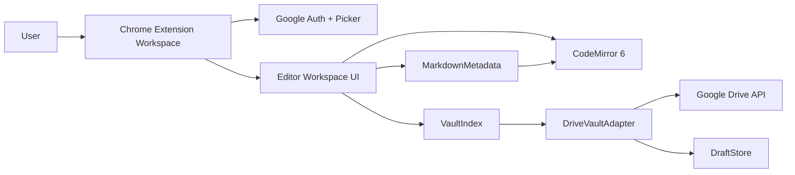

# Google Drive 기반 Obsidian-lite Chrome 확장 설계

## 요약

이 확장은 Obsidian이 설치되어 있지 않은 PC에서도 사용자가 Google Drive 폴더 안의 Markdown 파일을 Obsidian-lite vault처럼 열고 편집할 수 있게 한다. MVP는 확장 아이콘에서 전용 workspace 화면을 열고, Google Picker로 Google Drive 폴더 하나를 vault root로 연결하며, Obsidian 데스크톱 UI를 픽셀 단위로 복제하기보다 Obsidian에 가까운 편집 경험을 제공하는 데 집중한다.

추천 설계는 Drive-backed Markdown workspace다. Google Drive는 저장소 계층으로 다루고, 확장은 vault 탐색, Markdown 편집, 메타데이터 제어, 내부 링크 삽입, 검색, 안전한 저장 동작을 제공한다.

## MVP 결정사항

- 범위: Obsidian-lite MVP.
- 주 진입점: 확장 아이콘을 누르면 전용 workspace 페이지를 연다.
- 후속 진입점: `fileId`로 Drive 파일을 여는 route 구조는 남기되, Google Drive 웹 "Open with" 연동은 MVP에서 구현하지 않는다.
- Vault 연결: 사용자가 Google Picker로 Google Drive 폴더 하나를 선택하고, 그 폴더를 vault root로 사용한다.
- 편집기 엔진: CodeMirror 6.
- 저장 모델: autosave와 manual save를 함께 제공한다.
- 충돌 모델: 저장 전 Drive metadata 변경을 확인해 경고한다. MVP에는 merge UI를 넣지 않는다.
- Obsidian 호환성: YAML frontmatter, inline `#tag`, `[[Wiki Link]]`만 지원한다.
- 오프라인 모델: online-first. 저장 실패 시 local draft를 보존한다.
- UI 우선순위: Obsidian layout 복제보다 편집 경험, autocomplete, metadata/tag controls, 문서 저장 신뢰감을 우선한다.

## 비목표

- 전체 Obsidian plugin 호환성.
- backlinks, graph view, Dataview, canvas, 고급 block reference, transclusion.
- 전체 vault offline sync.
- Markdown 문법을 숨기는 rich-text editing.
- 자동 conflict merge 또는 three-way diff.
- 첫 릴리스에서 Google Drive 웹 "Open with" 연동.

## 아키텍처

확장은 Manifest V3 Chrome extension이며 전용 workspace page를 가진다. Workspace는 onboarding, vault state, file navigation, editor state, save status를 소유한다. Google 연동은 작은 adapter 뒤로 격리해 UI code가 Drive API request shape에 직접 의존하지 않게 한다.

### 핵심 경계

`DriveVaultAdapter`만 Google Drive가 folder, blob file, metadata, upload operation을 어떻게 표현하는지 안다. 그 위 계층은 모두 vault 용어로만 통신한다: folder, Markdown file, file path, file id, content, metadata, modified timestamp.

이 경계는 첫 릴리스를 작게 유지하면서도 이후 Drive 웹 연동, 추가 vault provider, 더 깊은 Obsidian 호환성으로 확장할 여지를 남긴다.

## 컴포넌트

### Extension Shell

- Manifest V3 extension을 정의한다.
- 확장 아이콘에서 workspace page를 연다.
- 앱 설정, 선택된 vault root, 가벼운 workspace preference를 저장한다.
- onboarding, workspace, future file-id based open flow를 위한 route를 제공한다.

### Google Integration

- Chrome Identity로 OAuth token을 얻는다.
- Folder selection이 활성화된 Google Picker를 연다.
- Drive API 호출과 token refresh/retry 동작을 감싼다.
- Google 오류를 `AuthRequired`, `PermissionDenied`, `RateLimited`, `NetworkFailed`, `RemoteChanged` 같은 app-level error type으로 변환한다.

### DriveVaultAdapter

Drive 기반 파일 작업을 담당한다.

- `listChildren(folderId)`
- `readFile(fileId)`
- `saveFile(fileId, content, expectedModifiedTime)`
- `createFile(parentFolderId, name, content)`
- `createFolder(parentFolderId, name)`
- `getFileMetadata(fileId)`
- `findDuplicateName(parentFolderId, name)`

Adapter는 parent folder로 scope가 제한된 Drive file query로 children을 나열하고, Drive media download로 blob file content를 읽고, Markdown 파일은 `text/markdown`으로 만들고, folder는 Drive folder resource로 만들며, 기존 Markdown content는 Drive upload/update API로 갱신한다.

### VaultIndex

선택된 vault root 아래 Markdown file의 client-side index를 유지한다.

- Drive file id.
- Extension을 제외한 display file name.
- Vault-relative full path.
- Parent folder id.
- MIME type.
- Modified time.

Index는 sidebar navigation, file search, breadcrumb 이동, `[[...]]` internal-link autocomplete에 사용된다. MVP는 vault가 열릴 때 index를 eager build하고, folder listing 시 Drive pagination을 처리하며, create/save 이후 변경된 entry를 refresh한다. Full background reindex scheduling은 첫 구현 이후로 미룬다.

### MarkdownMetadata

Markdown-compatible Obsidian 기본 요소를 parse/edit한다.

- 파일 맨 위의 YAML frontmatter block.
- Frontmatter property key/value update.
- `#project` 같은 inline tag.
- `[[Note Name]]` 같은 wiki link.

MVP parsing은 편집 대상 frontmatter field 밖의 사용자 텍스트를 보존한다. Property를 편집할 때는 frontmatter block만 갱신하고 Markdown body는 그대로 둔다.

### Editor Workspace UI

사용자에게 보이는 Obsidian-lite workspace를 제공한다.

- Folder와 Markdown file을 보여주는 sidebar.
- 현재 file path breadcrumb.
- Main CodeMirror editor pane.
- Metadata/properties panel 또는 compact header controls.
- Tag editing affordance.
- 기본 insert command용 slash command palette.
- `VaultIndex` 기반 internal-link autocomplete.
- Autosave/manual save 상태를 보여주는 save status indicator.

UI는 Obsidian-like dark theme, compact density, keyboard-first editing을 사용하되 모든 Obsidian pane 동작을 복제하기보다 browser extension clarity를 우선한다.

### DraftStore

Drive write 실패 시 local draft를 보존한다.

- Vault root id와 Drive file id로 key를 만든다.
- Content, 편집 시점 file metadata, last local edit time, failure reason을 저장한다.
- 작은 설정은 extension storage에 저장하고, 큰 draft body는 IndexedDB 또는 extension-local storage에 저장한다.
- 저장되지 않은 local content가 있는 파일을 다시 열 때 draft recovery를 노출한다.

## 데이터 흐름

### Vault 연결

1. 사용자가 extension workspace를 연다.
2. 저장된 vault root가 없으면 onboarding screen에서 Google Drive folder가 vault로 사용된다는 점을 설명한다.
3. 사용자가 Google 인증을 진행한다.
4. Folder selection이 활성화된 Google Picker를 연다.
5. 선택된 folder id와 name을 active vault root로 저장한다.
6. `VaultIndex`가 해당 folder 아래 Markdown file index를 초기 생성한다.

### 파일 열기

1. 사용자가 sidebar, search, breadcrumb, internal-link autocomplete에서 file을 선택한다.
2. Workspace가 `DriveVaultAdapter.readFile(fileId)`를 호출한다.
3. Workspace는 현재 Drive metadata, 특히 `modifiedTime`을 함께 저장한다.
4. CodeMirror가 file content를 받는다.
5. `MarkdownMetadata`가 frontmatter, tag, wiki link를 추출해 UI controls에 제공한다.

### 편집과 저장

1. CodeMirror 변경이 document를 dirty 상태로 표시한다.
2. Autosave가 debounced save를 queue에 넣는다.
3. Manual save는 같은 save pipeline을 즉시 실행한다.
4. 쓰기 전 adapter가 현재 remote metadata를 가져온다.
5. Remote `modifiedTime`이 session baseline보다 최신이면 conflict warning을 보여준다.
6. 충돌이 없으면 새 content를 Drive에 upload한다.
7. 성공하면 session baseline과 `VaultIndex` metadata를 갱신한다.
8. 실패하면 editor content를 memory에 유지하고 local draft를 저장한다.

### 내부 링크와 파일 검색

1. 사용자가 `[[`를 입력하거나 slash command에서 internal link를 연다.
2. CodeMirror autocomplete가 `VaultIndex.searchFiles(query)`를 호출한다.
3. 결과는 note title과 vault-relative path를 보여준다.
4. 사용자가 결과를 선택하면 `[[File Name]]`을 삽입한다.
5. Duplicate note name이 있으면 UI가 path context를 보여주고 Obsidian-style resolution이 ambiguous하다고 경고한다.

## Slash Commands

MVP slash command는 작게 유지한다.

- `/link`: Markdown external link skeleton을 삽입한다.
- `/wikilink`: internal-link search를 열고 `[[...]]`를 삽입한다.
- `/tag`: tag를 삽입하거나 선택한다.
- `/property`: frontmatter property를 focus하거나 생성한다.

Command는 component 곳곳의 ad hoc string mutation이 아니라 UI state에 연결된 CodeMirror command로 구현한다.

## 충돌 및 오류 처리

가장 중요한 원칙은 데이터 손실 방지다.

### 인증 및 권한 오류

- 현재 editor content를 계속 보여준다.
- Save state를 blocked로 표시한다.
- Re-auth 또는 permission retry action을 제공한다.
- Auth failure가 발생해도 local edit을 지우지 않는다.

### Network 또는 Drive API 실패

- Save state를 failed로 표시한다.
- 현재 document를 `DraftStore`에 저장한다.
- 마지막 성공 저장 시각과 local draft status를 보여준다.
- Connectivity 또는 API availability가 돌아오면 retry할 수 있게 한다.

### Remote change conflict

- 저장 전 현재 remote metadata를 비교한다.
- File을 열었거나 마지막으로 저장한 뒤 remote content가 바뀌었으면 warning을 보여준다.
- 사용자 선택지는 remote version reload 또는 current local content overwrite다.
- Overwrite 전 현재 local content를 `DraftStore`에 저장한다.
- MVP에는 merge UI를 넣지 않는다.

### Duplicate names

Google Drive는 같은 folder 안에 duplicate name을 허용하지만, Obsidian vault workflow는 note name이 의미 있게 unique하길 기대한다. MVP 동작은 다음과 같다.

- 같은 parent folder 안에서 duplicate file/folder name 생성을 막는다.
- 이미 연결된 Drive folder 안에 duplicate Markdown note title이 있으면 path context를 보여준다.
- Wiki link는 file name으로 삽입하고, 필요한 경우 ambiguity warning을 보여준다.

## 테스트 전략

### Unit tests

순수 module 중심으로 테스트한다.

- `MarkdownMetadata`: frontmatter detection, property update, tag extraction, wiki-link extraction, body preservation.
- `VaultIndex`: path construction, file-name search, duplicate display, `.md` filtering, create/save 후 update.

### Adapter tests

Google Drive client behavior를 mock한다.

- Folder listing and pagination.
- Blob content download.
- File content update.
- File and folder creation.
- 저장 전 metadata comparison.
- Permission failure.
- Token failure.
- Network failure and draft preservation.

### UI tests

Playwright 또는 동등한 browser test에서 mock vault provider를 사용한다.

- 선택된 vault root로 onboarding.
- File tree 표시.
- Markdown file 열기.
- 편집 후 autosave state 변화 확인.
- Manual save 실행.
- YAML frontmatter property 편집.
- `#tag` 삽입.
- Autocomplete로 `[[Wiki Link]]` 삽입.
- Mock metadata 변경 시 conflict warning 표시.
- Save failure 뒤 local draft recovery.

### Manual release checks

Test Google account와 test Drive folder를 사용한다.

- Picker로 Drive folder 선택.
- Folder와 Markdown file 생성.
- 편집 후 실제 Drive file content가 바뀌는지 확인.
- 같은 folder를 Obsidian에서 열어 frontmatter, tag, wiki link가 자연스럽게 보이는지 확인.
- Save failure를 강제로 만들고 local draft recovery를 확인.
- Extension 밖에서 file을 수정한 뒤 overwrite 전 conflict warning이 뜨는지 확인.

## 구현 메모

- Extension, adapter, parser, UI code는 TypeScript로 작성한다.
- Workspace UI는 React로 작성한다.
- Google API 사용은 `GoogleDriveClient`와 `DriveVaultAdapter` 뒤에 둔다.
- Markdown parsing/mutation은 React와 독립적으로 유지한다.
- 선택된 vault root와 UI preference는 `chrome.storage`에 저장한다.
- 큰 draft body는 `chrome.storage.sync` 밖에 저장한다. Sync quota를 피하기 위해 local extension storage 또는 IndexedDB를 사용한다.
- 구현 계획 단계에서 선택한 vault를 읽고 만들고 갱신하는 데 필요한 가장 좁은 Drive OAuth scope를 정당화한다.

## 확인한 공식 참고 문서

- Chrome Identity API: https://developer.chrome.com/docs/extensions/reference/api/identity
- Chrome Storage API: https://developer.chrome.com/docs/extensions/reference/api/storage
- Google Drive file search: https://developers.google.com/workspace/drive/api/guides/search-files
- Google Picker `DocsView` folder selection: https://developers.google.com/workspace/drive/picker/reference/picker.docsview
- Google Drive uploads: https://developers.google.com/workspace/drive/api/guides/manage-uploads

## 열린 구현 리스크

- OAuth scope 선택은 Chrome Web Store review friction과 user trust에 영향을 준다. 구현 계획에서 선택한 scope를 정당화해야 한다.
- 매우 큰 vault는 첫 MVP 이후 background indexing이 필요하다.
- Google Drive duplicate-name 동작은 확장 연결 전에 이미 duplicate가 있는 vault에서 ambiguity를 만든다.
- Google Picker와 Drive API setup에는 Cloud Console configuration이 필요하다. 구현 계획에 setup 절차를 포함해야 한다.
- Autosave frequency는 responsiveness와 Drive API quota/rate limit 사이에서 균형을 잡아야 한다.

