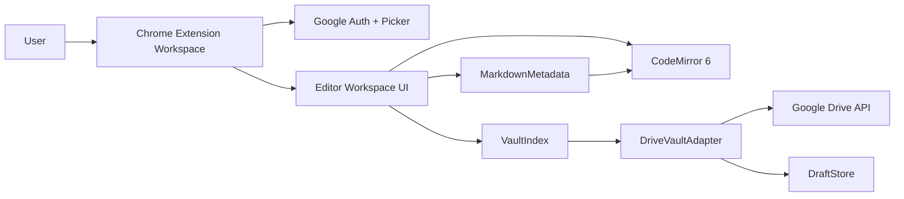

# Drive-backed Obsidian-lite Chrome Extension Design

## Summary

Build a Chrome extension that lets users edit Markdown files in a Google Drive folder as an Obsidian-lite vault when Obsidian is not installed on the current PC. The MVP opens from the extension icon into a dedicated workspace, connects one Google Drive folder as the vault root through Google Picker, and focuses on an Obsidian-like editing experience rather than a pixel-perfect clone of the Obsidian desktop UI.

The recommended design is a Drive-backed Markdown workspace: Google Drive is treated as the storage layer, while the extension provides vault navigation, Markdown editing, metadata controls, internal link insertion, search, and safe save behavior.

## MVP Decisions

- Scope: Obsidian-lite MVP.
- Primary entry point: extension icon opens a dedicated workspace page.
- Future entry point: keep route structure compatible with opening a Drive file by `fileId`, but do not implement Drive web integration in the MVP.
- Vault connection: user selects one Google Drive folder with Google Picker; that folder becomes the vault root.
- Editor engine: CodeMirror 6.
- Save model: autosave plus manual save.
- Conflict model: warning based on Drive metadata changes before save; no merge UI in the MVP.
- Obsidian compatibility: YAML frontmatter, inline `#tag`, and `[[Wiki Link]]` only.
- Offline model: online-first; save failures preserve local drafts.
- UI priority: editing experience, autocomplete, metadata/tag controls, and document confidence over exact Obsidian layout cloning.

## Non-goals

- Full Obsidian plugin compatibility.
- Backlinks, graph view, Dataview behavior, canvas, advanced block references, or transclusion.
- Full offline vault synchronization.
- Rich-text editing that hides Markdown syntax.
- Automatic conflict merge or three-way diff in the MVP.
- Google Drive web "Open with" integration in the first release.

## Architecture

The extension is a Manifest V3 Chrome extension with a dedicated workspace page. The workspace owns onboarding, vault state, file navigation, editor state, and save status. Google integration is isolated behind a small adapter so UI code does not depend directly on Drive API request shapes.

### Core boundary

`DriveVaultAdapter` is the only module that knows how Google Drive stores folders, blob files, metadata, and upload operations. Everything above it speaks in vault terms: folders, Markdown files, file paths, file IDs, content, metadata, and modified timestamps.

This keeps the first release small while preserving a path to later Drive web integration, additional vault providers, or richer Obsidian compatibility.

## Components

### Extension Shell

- Defines the Manifest V3 extension.
- Opens the workspace page from the extension icon.
- Stores app settings, selected vault root, and lightweight workspace preferences.
- Provides routes for onboarding, workspace, and future file-id based open flows.

### Google Integration

- Uses Chrome Identity for OAuth token acquisition.
- Opens Google Picker with folder selection enabled.
- Wraps Drive API calls and token refresh/retry behavior.
- Converts Google errors into app-level error types such as `AuthRequired`, `PermissionDenied`, `RateLimited`, `NetworkFailed`, and `RemoteChanged`.

### DriveVaultAdapter

Responsible for Drive-backed file operations:

- `listChildren(folderId)`
- `readFile(fileId)`
- `saveFile(fileId, content, expectedModifiedTime)`
- `createFile(parentFolderId, name, content)`
- `createFolder(parentFolderId, name)`
- `getFileMetadata(fileId)`
- `findDuplicateName(parentFolderId, name)`

The adapter lists children using Drive file queries scoped by parent folder, reads blob file content with Drive media download, creates Markdown files as `text/markdown`, creates folders as Drive folder resources, and updates existing Markdown content through Drive upload/update APIs.

### VaultIndex

Maintains a client-side index of Markdown files under the selected vault root:

- Drive file id.
- Display file name without extension.
- Full vault-relative path.
- Parent folder id.
- MIME type.
- Modified time.

The index powers sidebar navigation, file search, breadcrumb movement, and `[[...]]` internal-link autocomplete. The MVP builds the index eagerly when a vault is opened, handles Drive pagination when listing folders, and refreshes changed entries after create/save operations. Full background reindex scheduling is deferred beyond the first implementation.

### MarkdownMetadata

Parses and edits Markdown-compatible Obsidian basics:

- YAML frontmatter block at the top of the file.
- Frontmatter property key/value updates.
- Inline tags such as `#project`.
- Wiki links such as `[[Note Name]]`.

MVP parsing preserves user text outside the edited frontmatter field. When editing properties, it updates only the frontmatter block and leaves the Markdown body unchanged.

### Editor Workspace UI

Provides the user-facing Obsidian-lite workspace:

- Sidebar for folders and Markdown files.
- Breadcrumb for the current file path.
- Main CodeMirror editor pane.
- Metadata/properties panel or compact header controls.
- Tag editing affordance.
- Slash command palette for basic insert commands.
- Internal-link autocomplete powered by `VaultIndex`.
- Save status indicator with autosave/manual save state.

The UI uses an Obsidian-like dark theme, compact density, and keyboard-first editing, while optimizing for browser extension clarity instead of copying every Obsidian pane behavior.

### DraftStore

Preserves local drafts when Drive writes fail:

- Keyed by vault root id and Drive file id.
- Stores content, file metadata seen at edit time, last local edit time, and failure reason.
- Uses extension storage for small settings and IndexedDB or extension-local storage for larger draft bodies.
- Surfaces draft recovery when reopening a file with unsaved local content.

## Data Flow

### Vault connection

1. User opens the extension workspace.
2. If no vault root is saved, the onboarding screen explains that a Google Drive folder will be used as a vault.
3. User authenticates with Google.
4. Google Picker opens with folder selection enabled.
5. The selected folder id and name are saved as the active vault root.
6. `VaultIndex` builds the initial Markdown file index under that folder.

### File open

1. User selects a file from sidebar, search, breadcrumb, or internal-link autocomplete.
2. Workspace calls `DriveVaultAdapter.readFile(fileId)`.
3. Workspace also stores current Drive metadata, especially `modifiedTime`.
4. CodeMirror receives the file content.
5. `MarkdownMetadata` extracts frontmatter, tags, and wiki links for UI controls.

### Editing and saving

1. CodeMirror changes mark the document dirty.
2. Autosave queues a debounced save.
3. Manual save triggers the same save pipeline immediately.
4. Before writing, the adapter fetches current remote metadata.
5. If remote `modifiedTime` is newer than the session baseline, show a conflict warning.
6. If no conflict is detected, upload the new content to Drive.
7. On success, update the session baseline and `VaultIndex` metadata.
8. On failure, keep editor content in memory and persist a local draft.

### Internal links and file search

1. User types `[[` or opens the slash command for an internal link.
2. CodeMirror autocomplete calls `VaultIndex.searchFiles(query)`.
3. Results show note title and vault-relative path.
4. Selecting a result inserts `[[File Name]]`.
5. If duplicate note names exist, the UI displays path context and warns that Obsidian-style resolution is ambiguous.

## Slash Commands

MVP slash commands are intentionally small:

- `/link`: insert a Markdown external link skeleton.
- `/wikilink`: trigger internal-link search and insert `[[...]]`.
- `/tag`: insert or select a tag.
- `/property`: focus or create a frontmatter property.

Commands are implemented as CodeMirror commands backed by UI state, not as ad hoc string mutations spread through components.

## Conflict and Error Handling

Data loss prevention is the first priority.

### Authentication and permission errors

- Keep current editor content visible.
- Mark save state as blocked.
- Offer a re-auth or permission retry action.
- Do not clear local edits on auth failure.

### Network or Drive API failures

- Mark save state as failed.
- Persist the current document to `DraftStore`.
- Show last successful save time and local draft status.
- Allow retry when connectivity or API availability returns.

### Remote change conflicts

- Compare current remote metadata before saving.
- If remote content changed since the file was opened or last saved, show a warning.
- User choices: reload remote version or overwrite with current local content.
- Before overwrite, save the current local content to `DraftStore`.
- No merge UI in the MVP.

### Duplicate names

Google Drive allows duplicate names in the same folder, but Obsidian vault workflows expect note names to be meaningfully unique. MVP behavior:

- Block creating duplicate file or folder names within the same parent folder.
- Show path context when duplicate Markdown note titles already exist in the imported Drive folder.
- Insert wiki links by file name, with ambiguity warnings when needed.

## Testing Strategy

### Unit tests

Focus on pure modules:

- `MarkdownMetadata`: frontmatter detection, property update, tag extraction, wiki-link extraction, body preservation.
- `VaultIndex`: path construction, file-name search, duplicate display, `.md` filtering, update after create/save.

### Adapter tests

Mock Google Drive client behavior:

- Folder listing and pagination.
- Blob content download.
- File content update.
- File and folder creation.
- Metadata comparison before save.
- Permission failure.
- Token failure.
- Network failure and draft preservation.

### UI tests

Use a mock vault provider for Playwright or equivalent browser tests:

- Onboard with selected vault root.
- Display file tree.
- Open a Markdown file.
- Edit and see autosave state changes.
- Trigger manual save.
- Edit YAML frontmatter property.
- Insert `#tag`.
- Insert `[[Wiki Link]]` through autocomplete.
- Show conflict warning when mock metadata changes.
- Recover a local draft after a failed save.

### Manual release checks

Use a test Google account and test Drive folder:

- Select a Drive folder through Picker.
- Create a folder and Markdown file.
- Edit and confirm the actual Drive file content changes.
- Open the same folder in Obsidian and confirm frontmatter, tags, and wiki links remain natural.
- Force a save failure and confirm local draft recovery.
- Modify the file outside the extension and confirm conflict warning appears before overwrite.

## Implementation Notes

- Use TypeScript for extension, adapter, parser, and UI code.
- Use React for workspace UI.
- Keep Google API usage behind `GoogleDriveClient` and `DriveVaultAdapter`.
- Keep Markdown parsing and mutation independent of React.
- Store selected vault root and UI preferences in `chrome.storage`.
- Store large draft bodies outside `chrome.storage.sync`; use local extension storage or IndexedDB to avoid sync quota issues.
- Request the narrowest Drive OAuth scope that still supports selecting, reading, creating, and updating files in the chosen vault during implementation planning.

## Official References Checked

- Chrome Identity API: https://developer.chrome.com/docs/extensions/reference/api/identity
- Chrome Storage API: https://developer.chrome.com/docs/extensions/reference/api/storage
- Google Drive file search: https://developers.google.com/workspace/drive/api/guides/search-files
- Google Picker `DocsView` folder selection: https://developers.google.com/workspace/drive/picker/reference/picker.docsview
- Google Drive uploads: https://developers.google.com/workspace/drive/api/guides/manage-uploads

## Open Implementation Risks

- OAuth scope choice affects Chrome Web Store review friction and user trust; implementation planning must justify the selected scope.
- Very large vaults require background indexing beyond the first MVP implementation.
- Google Drive duplicate-name behavior creates ambiguity when the vault already contains duplicates before the extension connects.
- Google Picker and Drive API setup require Cloud Console configuration; the implementation plan must include setup steps.
- Autosave frequency must balance responsiveness against Drive API quota and rate limits.
